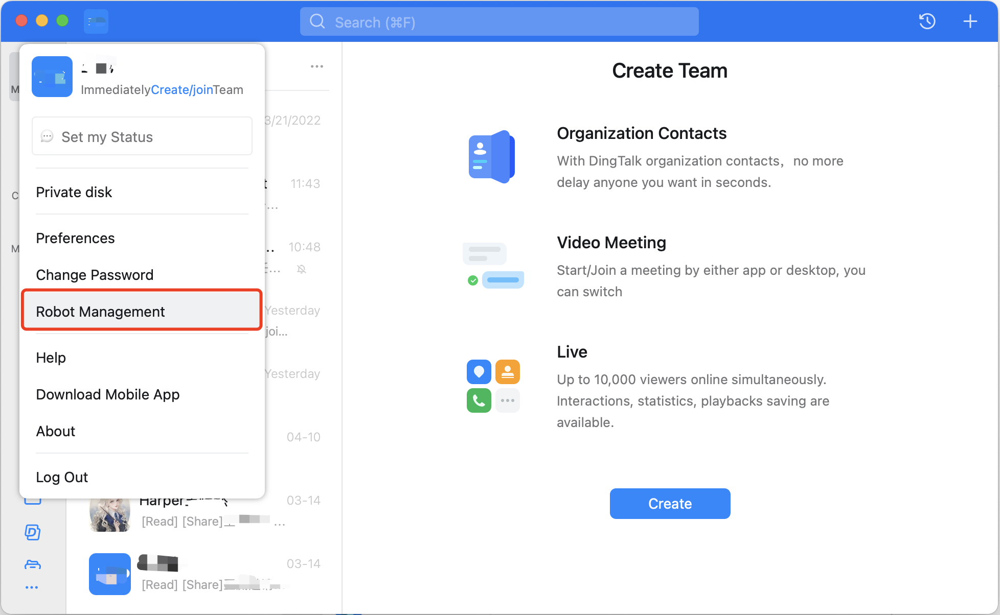
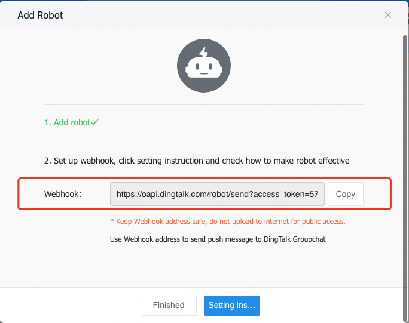

# Ding Talk

This guide contains information to set up a Ding Talk Sink in Vanus Cloud.

## Introduction

Ding Talk is a communication and collaboration platform, which provides instant messaging, video conferencing, and other communication tools for businesses and organizations. With the Streams menu and Ding Talk Sink connector in Vanus Cloud, you can easily forward real-time updates to a Ding Talk group chat, allowing your team to stay up-to-date on all events generated by your application.

## Prerequisites

Before forwarding events to Ding Talk, you must have:

- A [Vanus Cloud account](https://cloud.vanus.ai)
- A Ding Talk account with administrative privileges
- A Ding Talk group chat to which you want to send the events

## Getting Started

**To set up a bot for receiving events in your Ding Talk group chat:**

### Step 1: Add Bot for group in Ding Talk

1. Log in to your Ding Talk.

2. In the top navigation pane, click **Robot Management**.

   

3. In the **Robot Management** page, click **Custom**.

    

4. In the **Robot details** page, click **Add**.

    

5. In the **Add Robot** dialog:

    

    - In the **Chatbot name** field, provide a name for the robot.
    - In the **Add to Group** field, select the target group in which the Robot will create.
    - In the **Security Settings** field, selected the **Additional Signature**.
    - Accept the Terms of Service.
    - Click **Finished**.

6. Then get the **Webhook**.

    

### Step 2: Set up the Ding Talk Sink connector in Vanus Cloud

In Vanus Cloud, select Ding Talk, In the **Sink Configuration** page, specify the following:：

1. **Webhook URL**: The webhook address that message sent to, you can get it when you create Chat Bot. You retrieved in **Step 1** above.

2. **Signature Verification**: The signature to sign request, you can get it when you create Chat Bot. You retrieved in **Step 1** above.

Click **Next** to continue.


## Required Data Format
The event data must be JSON format, here a simple message, example:

```json
{
    "id": "53d1c340-551a-11ed-96c7-8b504d95037c",
    "source": "sink-Dingtalk-quickstart",
    "specversion": "1.0",
    "type": "quickstart",
    "datacontenttype": "text/plain",
    "time": "2022-10-26T10:38:29.345Z",
    "xvchatgroup": "bot1",
    "xvmsgtype": "text",
    "data": "Hello dingtalk"
}
```